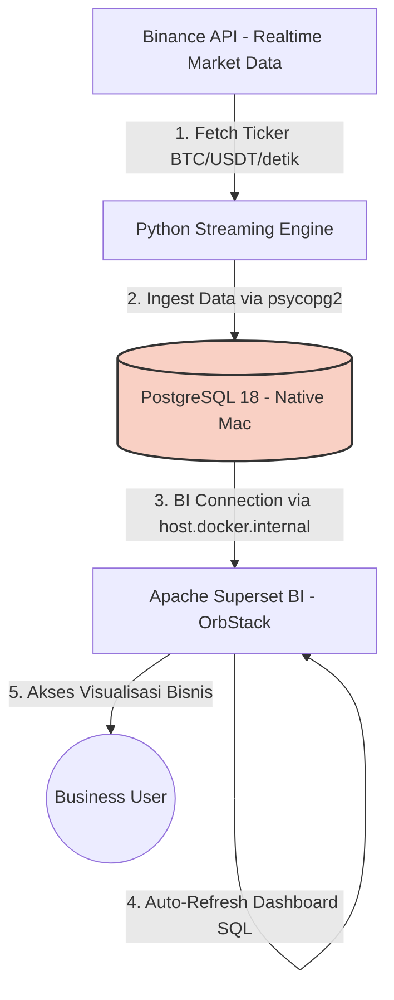

# Real-Time Financial Market Business Intelligence Dashboard

Dalam industri dengan volume perputaran tinggi (misalnya logistik kargo atau pasar finansial), keterlambatan menganalisis data dalam hitungan detik dapat mengakibatkan kerugian finansial yang besar. Data perlu diolah menjadi **Business Intelligence (BI) Dashboard** yang mudah dipahami oleh *stakeholders* non-teknis, tanpa perlu melakukan *query* manual.

## Tujuan
Membangun pipeline data finansial skala *enterprise* yang:
1. Mengalirkan data transaksi/market (contoh: kripto Bitcoin/Ethereum) secara **real-time** ke basis data terpusat.
2. Menyajikannya ke dalam **dashboard Apache Superset** untuk pemantauan pergerakan harga dan volume pasar.

## Arsitektur Aplikasi (Diagram Workflow)



## Struktur Proyek

```text
BI-Sales-Market/
├── src/                        # Core Application Logic
│   ├── api_client.py           # Binance API Client
│   ├── config.py               # Global Configurations
│   └── db_manager.py           # PostgreSQL Operations
├── scripts/                    # Initialization Scripts
│   ├── setup_database.py       # Create tables and indexes
│   └── setup_superset.py       # Auto-configure dashboards via REST API
├── tests/                      # Automated Testing Suites
├── run_streaming.py            # Main entry point for the data pipeline
├── docker-compose.yml          # Apache Superset container setup
└── requirements.txt            # Python dependencies
```

## Cara Menjalankan (Setup)

1. **Install Dependencies**
   ```bash
   pip install -r requirements.txt
   ```

2. **Setup Database (PostgreSQL)**
   Pastikan PostgreSQL berjalan di localhost:5432 dengan kredensial `postgres/postgres123` (bisa diubah di `src/config.py`).
   Lalu jalankan skrip inisiasi:
   ```bash
   python scripts/setup_database.py
   ```

3. **Start Apache Superset**
   Jalankan container untuk BI Dashboard:
   ```bash
   docker compose up -d
   ```
   Tunggu hingga container `superset-init` berstatus _completed/exited_.

4. **Setup Superset Dashboards**
   Untuk membuat tabel dataset, diagram chart, dan mem-*publish* dashboard secara otomatis:
   ```bash
   python scripts/setup_superset.py
   ```

5. **Start Real-Time Streaming**
   Jalankan pipeline *data ingesting*:
   ```bash
   python run_streaming.py
   ```

6. **Akses Dashboard**
   Buka `http://localhost:8088/` dan login dengan kredensial bawaan:
   - **Username**: `admin`
   - **Password**: `admin123`
