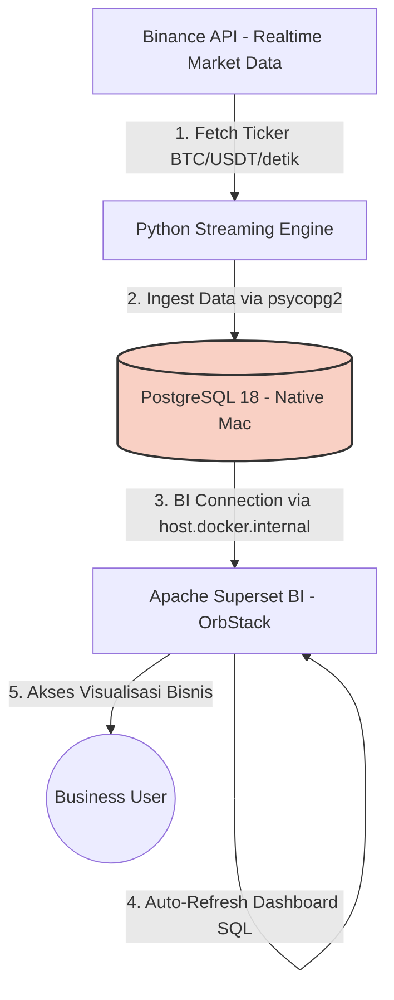

# Real-Time Financial Market Business Intelligence Dashboard (Apache Superset)

## 1) Judul, Latar Belakang, & Tujuan

### Judul
**Real-Time Financial Market Business Intelligence Dashboard**

### Latar Belakang
Dalam industri dengan volume perputaran tinggi (misalnya logistik kargo atau pasar finansial), keterlambatan menganalisis data dalam hitungan detik dapat mengakibatkan kerugian finansial yang besar. Data perlu diolah menjadi **Business Intelligence (BI) Dashboard** yang mudah dipahami oleh *stakeholders* non-teknis, tanpa perlu melakukan *query* manual.

### Tujuan
Membangun pipeline data finansial skala *enterprise* yang:
1. Mengalirkan data transaksi/market (contoh: kripto Bitcoin/Ethereum) secara **real-time** ke basis data terpusat.
2. Menyajikannya ke dalam **dashboard Apache Superset** untuk pemantauan pergerakan harga dan volume pasar.

---

## 2) Tools yang Digunakan

- **Environment:** VS Code, Mac M1 (OrbStack untuk Docker), Python 3.11  
- **Sumber Data:** Binance Public API (Ticker Data)  
- **Backend Pipeline:** Python (`requests`, `time`, `psycopg2`)  
- **Database Terpusat:** PostgreSQL 18 (native host)  
- **Visualisasi BI:** Apache Superset (jalan via OrbStack)

---

## 3) Arsitektur Aplikasi (Diagram Workflow)

**Ringkas alur:**
1. Python mengambil data ticker market dari Binance secara periodik (real-time).
2. Data di-*ingest* (insert) ke PostgreSQL menggunakan `psycopg2`.
3. Apache Superset (di container OrbStack) mengakses PostgreSQL di host Mac melalui `host.docker.internal`.
4. Superset menjalankan query SQL dan dashboard melakukan refresh untuk update data terbaru.
5. Stakeholder mengakses visualisasi bisnis (tren harga/volume) tanpa query manual.

---

## 4) Testing (Skenario Pengujian)

1. **Test 1 (API Latency)**
   - Pastikan script Python mampu menarik harga (mis. BTC) dari Binance **di bawah 1 detik** (sesuai target).
   - Pastikan tidak terkena blokir atau *rate limit*.

2. **Test 2 (Database Connection / Insert Rate)**
   - Pastikan PostgreSQL mampu menerima sisipan data berkecepatan tinggi (*high-frequency inserts*).
   - Verifikasi jumlah baris bertambah konsisten sesuai interval.

3. **Test 3 (Network Bridge: Superset ↔ PostgreSQL Host)**
   - Pastikan Superset dalam OrbStack bisa membaca database di Mac menggunakan connection string host:
     `postgresql://postgres@host.docker.internal:5432/portofolio_db`
   - Validasi dengan melakukan “Test Connection” saat menambahkan Database di Superset.

4. **Test 4 (UI Responsiveness)**
   - Jalankan query SQL (agregasi, window function, time-bucketing) di Superset.
   - Pastikan dashboard tidak crash saat data bertambah hingga ribuan baris.

---

## 5) Evaluasi & Validasi

### Kriteria Sukses (True)
- Data harga dan volume masuk mulus ke PostgreSQL (tidak ada gap besar atau insert gagal).
- Superset berhasil membuat visualisasi **Candlestick** atau **Time-Series Line Chart** yang berubah mengikuti data terbaru (melalui refresh dashboard).

### Jika Gagal (False) → kembali ke Tahap 4 (Testing/Debugging)
Fokus perbaikan yang umum:
- **Network Bridge:** Superset gagal konek ke PostgreSQL host (`host.docker.internal` / port / auth).
- **Kinerja Python loop:** penumpukan memori/CPU karena loop terlalu rapat → perlu jeda `time.sleep()` atau batching insert.
- **Rate limit API:** perlu atur frekuensi request atau strategi retry/backoff.

---

## 6) Kesimpulan

Jika Tahap 5 menghasilkan **True**, proyek dinyatakan sukses.

Proyek ini membuktikan kapabilitas **Full-Stack Data Engineering & Analytics**:
- Mengubah data market berkecepatan tinggi (raw, real-time) menjadi data terstruktur di PostgreSQL.
- Menyajikan insight dalam bentuk BI Dashboard kelas *enterprise* menggunakan Apache Superset, yang dapat dipakai oleh level manajemen dan stakeholder non-teknis.
